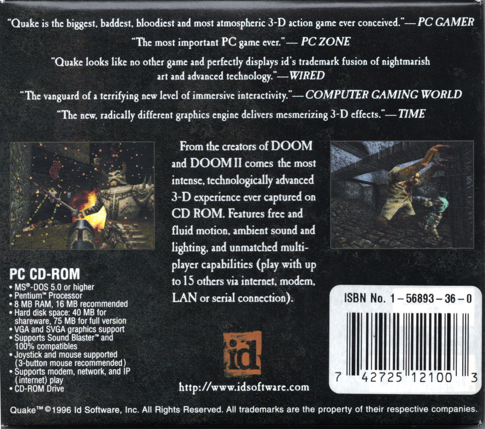

Contributors  
[kevansevans](https://github.com/kevansevans): organization suggestions

# Notes 000 - Introduction  
After spending some time looking into DOOM code and building up some knowledge, I wanted to look at another id software game source, and the next step from DOOM is Quake! I have lots of memory playing Quake! I still remember playing on my Pentium running at 90MHz with 8MB of RAM, and what an experience it was (and still is).  

Remember I am just a computer graphics hobbyist, so before jumping in to Quake code, I decided to spend some time learning more about 3D math, computer graphics. I have learned a lot, and at some point, I wanted to go back to DIYDOOM and just start it from scratch. Looking at DIYDoom now, there is a lot I can improve on, but sometimes you must move forward and not keep iterating on the same thing (don't worry I will go back and improve on it at some point).  

My approach to implement DIYQuake will be different, I will try to keep things much closer to how Quake implemented things (like how Handmade Quake project was doing, what a bummer that project got canceled).  

As it was the case with DIYDOOM, I will be sharing my notes, maybe it would help someone else break his/her fears looking at the game engine source code, I will try to keep a detailed documentation of my progress and what I find in Quake code.  

My focus will be on WinQuake, it is the software rendering version of Quake that was designed to run on Windows 95.  
What makes Quake stand out from earlier id software titled is that Quake used true 3D Maps (allowing rooms on top of each other), 3D models, a 3D rendering pipeline, light maps, and lots more!  

## Quake Game Requirements
To relive the release of Quake, it is good idea to have a look at the game requirements, here is a look at the back of the tri-fold CD case   
  
  
  
Due to huge game assets size (~50MB), Quake was released on a CD-ROM.    
Note: Yes, 50MB back then was a lot of space, I only had 500MB HDD.  

After the release of Quake in 1996, the game received a handful of updates during its lifetime, the most notable update was V1.09 which added OpenGL hardware acceleration support.  

I was able to get my hands on two different Quake CD releases (V1.06 and V1.09) Both those versions came with different binaries, but identical PAK files (PAK files contain game assets, texture, models, maps, etc). Here is a list of the Quake directory after they are being installed  

V1.06 CD-ROM  

```
QUAKE
COMEXP.TXT  CWSDPMI.EXE GENVXD.DLL   HELP.TXT    LICINFO.TXT
MANUAL.TXT  MGENVXD.VXD ORDER.TXT    PDIPX.COM   Q95.BAT
QLAUNCH.EXE QUAKE.EXE   QUAKEUDP.DLL README.TXT  RESOURCE.EXE
RLICNSE.TXT TECHINFO.TXT

QUAKE\ID1
CONFIG.CFG   PAK0.PAK    PAK1.PAK
```

Notice this release only came with DOS Quake version  
**QUAKE.EXE** Software rendering for DOS


V1.09 CD-ROM  

```
QUAKE
CWSDPMI.EXE  FXMEMMAP.VXD GENVXD.DLL   GLQUAKE.EXE  MGENVXD.VXD
OPENGL32.DLL PDIPX.COM    PMPRO16.DLL  PMPRO32.DLL  Q95.BAT 
QLAUNCH.EXE  QUAKE.EXE    QUAKEUDP.DLL VQUAKE.EXE   WDIR16.DLL 
WDIR32.DLL   WDIRNOP.COM  WDIRNOP.PIF  WINQUAKE.EXE WQ.BAT

QUAKE\DOCS
QUAKE.CNT QUAKE.HLP

QUAKE\DOCS\DOS
3DFX.TXT     COMEXP.TXT   GLREADME.TXT  HELP.TXT    JOYSTICK.TXT 
LICENSE.TXT  LICINFO.TXT  MANUAL.TXT    ORDER.TXT   README.TXT 
TECHINFO.TXT WQREADME.TXT

QUAKE1_09\ID1
CONFIG.CFG   PAK0.PAK      PAK1.PAK

QUAKE1_09\ID1\GLQUAKE
15TO8.PAL     RMOR.MS2     BACKPACK.MS2   BOLT.MS2     BOLT2.MS2 
BOLT3.MS2     DEMON.MS2    DOG.MS2        EYES.MS2     FLAME.MS2
FLAME2.MS2    GIB1.MS2     GIB2.MS2       GIB3.MS2     GRENADE.MS2
G_NAIL.MS2    G_ROCK.MS2   G_SHOT.MS2     H_DEMON.MS2  H_DOG.MS2 
H_GUARD.MS2   H_OGRE.MS2   H_PLAYER.MS2   H_WIZARD.MS2 H_ZOMBIE.MS2 
INVISIBL.MS2  LAVABALL.MS2 MISSILE.MS2    OGRE.MS2     PLAYER.MS2 
QUADDAMA.MS2  SOLDIER.MS2  SPIKE.MS2      SUIT.MS2     S_SPIKE.MS2 
V_AXE.MS2     V_LIGHT.MS2  V_NAIL.MS2     V_NAIL2.MS2  V_ROCK.MS2 
V_ROCK2.MS2   V_SHOT.MS2   V_SHOT2.MS2    WIZARD.MS2   W_G_KEY.MS2 
W_SPIKE.MS2   ZOMBIE.MS2   ZOM_GIB.MS2 
```

This version came with four different binaries to run Quake   
**QUAKE.EXE** Software rendering for DOS  
**WINQUAKE.EXE** Software rendering for Windows  
**VQUAKE.EXE** Hardware accelerated rendering for [Verite V1000 accelerator](https://en.wikipedia.org/wiki/Rendition_(company))    
**GLQUAKE.EXE** Hardware accelerated OpenGL version  

If you buy the steam version of Quake, you will get V1.09, and Quake world binaries.  

One more interesting fact comparing both CDs, files size of V1.06 CD-ROM is only 24MB, everything on the CD is compressed, and a full install is required to play the game, while the files size of V1.09 CD-ROM version is 78MB which included a “Data” folder with the content uncompressed. My initial thoughts were to allow the game to run from the CD-ROM (by having a minimum installation mode and reading the assets from the CD-ROM), but the windows installer never gave such an option, and a full installation was required to play the game under windows. It just seems weird to me, specially that the game source code seems to support reading assets from any location.  

## Source Code
A copy of [Quake source code](https://github.com/id-Software/Quake) can be found on id software GitHub account.

But the question is how can you compile the code and get a working binary? This is what I will be explaining next. 

## Goal
Compile original WinQuake

## Compiling the code
The easiest way to get the code to compile is to find a Windows 9x machine (maybe a virtual machine) get Visual studio 6 installed. With no code changes, you would be able to open the [works space](https://github.com/id-Software/Quake/blob/master/WinQuake/WinQuake.dsw) file and get the project compiled. But for most people that is not feasible, mostly you want this code to compile under a modern operating system and with a newer version of visual studio.  
Note: You might need to do an EOL (end of line) conversion. What is checked into the git repro is a Unix EOL format, which win98 would not recognize.

The source code for Quake that id software released come with a Quake and, Quake world. Our focus is Quake... WinQuake.

To be able to get Quake compiling under a newer version of visual studio all you need to do is create a new Project, and cheat from [WinQuake Project File](https://github.com/id-Software/Quake/blob/master/WinQuake/WinQuake.dsp) to see which header, CPP files and libraries need to be added to your project to get it to compile. Here is a quick summary of the process, don't worry I have done the hard work for you, if you are not interested in the process just go grab the [Visual Studio 2019 Solution](../src).  

Note: when installing VS2019, do not forget to install MFC, and windows SDK.  

[WinQuake.dsp](https://github.com/id-Software/Quake/blob/master/WinQuake/WinQuake.dsp) is a simple text file that lists compiler flags and files that are included in the project.

Looking at the project file, it builds 4 targets. 

```
winquake - Win32 Release
winquake - Win32 Debug
winquake - Win32 GL Debug
winquake - Win32 GL Release
```

What we are interested in is the Release and Debug version, skip the OpenGL version

going through the workspace file here are what you will need to do

add scitech include folder  

```
.\scitech\include
.\dxsdk\SDK\INC
```

and scitech lib to your project

```
.\scitech\lib\Win32\VC
.\dxsdk\SDK\LIB
```

Those are all the libs you will need

```
Winmm.lib
DXGUID.LIB
wsock32.lib
MGLLT.LIB
```

Some of functions have two different implementation, assembly ```*.s``` and C version. I will be ignoring the assembly implementation and just get things working with the C version of the functions. It is worth noting that John Carmack noted that if we compile using C files implementation, we will lose almost half the performance [compared to assembly](https://github.com/id-Software/Quake/blob/master/readme.txt).

A complete list of all the files you will need.
```
adivtab.h    anorms.h    anorm_dots.h bspfile.h
cdaudio.h    client.h    cmd.h        common.h
conproc.h    console.h   crc.h        cvar.h
draw.h       d_iface.h   d_local.h    input.h
keys.h       mathlib.h   menu.h       model.h
modelgen.h   net.h       net_dgrm.h   net_loop.h
net_vcr.h    net_wins.h  net_wipx.h   progdefs.h
progs.h      protocol.h  pr_comp.h    quakedef.h
render.h     resource.h  r_local.h    r_shared.h    
sbar.h       screen.h    server.h     sound.h
spritegn.h   sys.h       vid.h        view.h
wad.h        winquake.h  world.h      zone.h    

cd_win.c     chase.c     cl_demo.c    cl_input.c
cl_main.c    cl_parse.c  cl_tent.c    cmd.c
common.c     conproc.c   console.c    crc.c
cvar.c       draw.c      d_edge.c     d_fill.c
d_init.c     d_modech.c  d_part.c     d_polyse.c
d_scan.c     d_sky.c     d_sprite.c   d_surf.c
d_vars.c     d_zpoint.c  host.c       host_cmd.c
in_win.c     keys.c      mathlib.c    menu.c
model.c      net_dgrm.c  net_loop.c   net_main.c
net_vcr.c    net_win.c   net_wins.c   net_wipx.c    
nonintel.c   pr_cmds.c   pr_edict.c   pr_exec.c
r_aclip.c    r_alias.c   r_bsp.c      r_draw.c 
r_edge.c     r_efrag.c   r_light.c    r_main.c
r_misc.c     r_part.c    r_sky.c      r_sprite.c
r_surf.c     r_vars.c    sbar.c       screen.c
snd_dma.c    snd_mem.c   snd_mix.c    snd_win.c
sv_main.c    sv_move.c   sv_phys.c    sv_user.c
sys_win.c    vid_win.c   view.c       wad.c
world.c      zone.c 

progdefs.q1  progdefs.q2

quake.ico

winquake.rc
```

Note: If you see compiler error, just google them, they are changes in the windows APIs and headers, they are all common error, they should be very easy to fix.
Note: After getting the code to compile, I noticed some of those files are not needed, but for now I will leave them there.  

## Running and Debugging
Now you should be able to run the game by just clicking the run button. You might need to change the working directory folder in the settings to get the WinQuake binary to find the id1 folder where the game assets are. I have included the Shareware version of the assets under [external/Assets](../../external/Assets).

Note: You can add ```-startwindowed``` as a startup argument if you want the game to start in windows mode.  

Note: For debugging you can set break points in the code or call the function ```Con_Printf``` and print the output strings to the Quake console, don't forget to add ```-condebug``` as startup argument which will dump all the console text to a ```qconsole.log``` file for you.  

## Notes
I will be keeping two copies of the original code, first copy of the code is under [Notes000/src](../src) folder, this is WinQuake as it was released by id software (with minimal change to get it to compile) The second copy is under [misc](../../misc/src) folder which I will be using for debugging and tracing, I will be adding comments and renaming variables to help me trace and understand the code.  

## Contributions  
I'm not perfect, so If you find errors, bugs, concerned, or disagree with what I have, contact me, we are all here to learn and you will be credited.  
