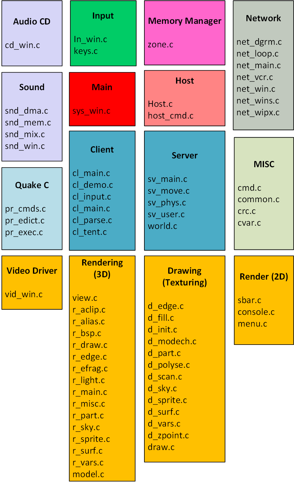
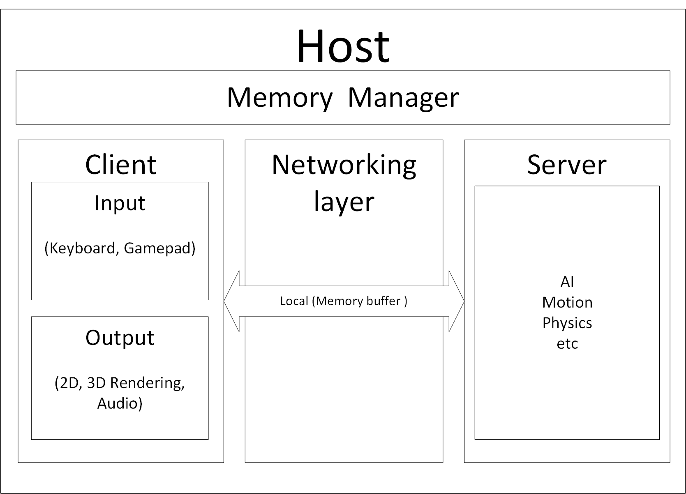
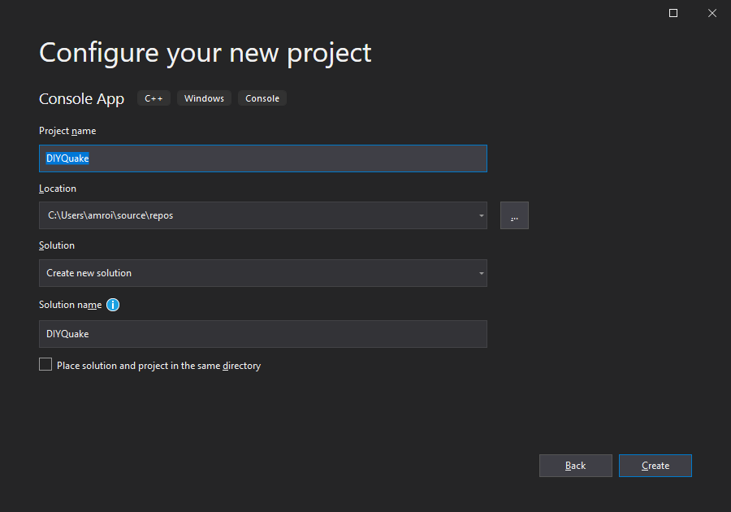
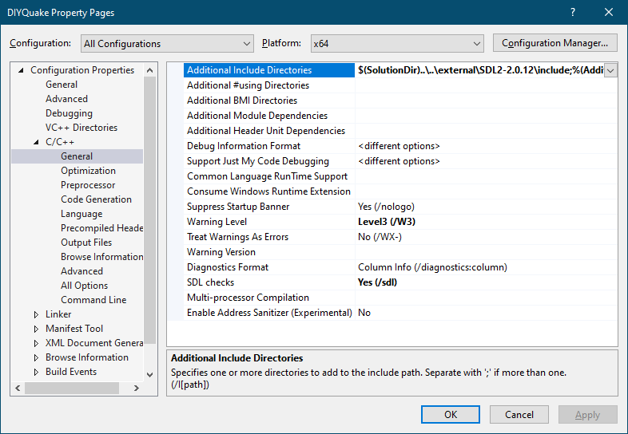
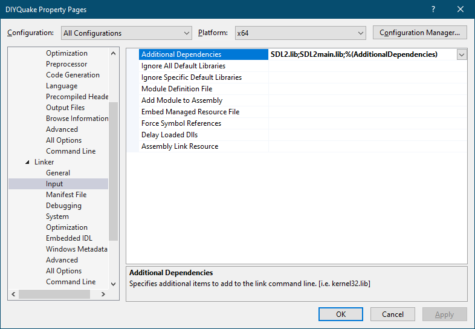

# Notes 001 - The Big Picture
[__Recommended Reading__ : Quake’s 3-D Engine: The Big Picture by Michael Abrash](https://www.bluesnews.com/abrash/chap70.shtml)  
  
To start looking into any code, it is best to try and understand things as black boxes, to have a basic idea what to expect when we dive into the code. After we successfully got WinQuake to compile, we can go thought the code and look at how it draws a single frame on the screen and the best way to accomplish this is by looking for the EXE entry point (the "main" function) and drive our way from there.  

Before we start, I would like to express my feelings after having a look at the code, the code is mind blowing! Tricks I have never seen before, and brilliant piece of engineering. Quake is much easier to read compared to DOOM, also the code has lots of in code documentation that clarify what is going one. Let's jump in!  

WinQuake is a Win32 binary, that means the main function will be called "WinMain". WinMain can be found in [sys_win.c](../../Notes000/src/WinQuake/WinQuake/sys_win.c#L687). It is important to note that OS APIs are always isolated in its own separate files.  

For example, files with postfix ```*_win.c``` is a windows specific files, so if you are compiling for Windows, you want to link with ```*_win.c``` files. To keeps things generic and portable files with postfix ```*_null.c``` where created, those files are the ones you should implement to support the OS you want (if not already supported). This design makes porting the code from one OS to another a simple task, and by simply creating a copy of the ```*_null.c``` file and implementing it to the target OS.  

Now looking at ```sys_*.c``` files we see a handful of OSs supported.  

```cpp
sys_null.c   // file to be implemented for each OS
sys_dos.c 
sys_linux.c 
sys_sun.c
sys_win.c
```

It is self-explanatory which file is for which OS.  

Now let’s go back to the Windows version WinMain, and have a quick look what happens there  
Note: The comments below are mix of what was in original code + mine  

```cpp
int WINAPI WinMain (HINSTANCE hInstance, HINSTANCE hPrevInstance, LPSTR lpCmdLine, int nCmdShow)
{
    ...
    GlobalMemoryStatus (&lpBuffer); // Read memory statistics, to know how much memory is available
    ...   
    if (!isDedicated) // if not running as dedicated server
    {
      // Show a dialog that Quake is starting (dialog shown below)
      ...
    }
    // make some memory decisions
    ...
    parms.membase = malloc (parms.memsize); // Allocate the memory, (we will cover next note set)
    ...
    if (isDedicated) // Actions to do if it is running as dedicated server (We don't care about that for now so let’s just skip it)
    {
        ...
    }
    Sys_Init (); // more system initializations
    ...	
    Host_Init (&parms); // Host initialization, a lot happens in this function (including server initialization and main windows creation)
    oldtime = Sys_FloatTime (); // Read system time
    // the game loop
    while (1)
    {
        if (isDedicated) // Do this if dedicated server!
        {
           ...
        }
        else
        { 
            ...
            newtime = Sys_FloatTime (); // Read time
            time = newtime - oldtime;
        }
        Host_Frame (time); // All the magic happens in this function 
        oldtime = newtime; // Read time
    }
    /* return success of application */
    return TRUE;
}

```

The dialog that is show when Quake start  

  

Summarizing what happens in  ```WinMain```, it is starts by initializing the system, and doing memory allocation, then start the game loop. Looking at the game loop there is few things to note, on each frame the elapsed time is passed in as a parameter (time passed since the last frame update), that means that the engine will advance the game world by that amount of time. This will allow the game to run at consistent rate even if hardware for different machine run at different frame rates. I would recommend reading [Game Loop Pattern by Robert Nystrom](https://gameprogrammingpatterns.com/game-loop.html#one-small-step,-one-giant-step), which also covers the floating-point error as a side effect.  

Now we know what happens in WinMain, let’s have a look what happens in ```Host_Fram```.  ```Host_Fram``` just calls the helper function ```_Host_Frame(time)``` so let’s focus on that.  

The function ```_Host_Frame``` can be found in [host.c](../../Notes000/src/WinQuake/WinQuake/host.c#L633)  

```cpp
void _Host_Frame(float time)
{
    ...
    if (!Host_FilterTime(time)) // Limit the frame rate to max of 72 fps!!!
        return; // don't run too fast, or packets will flood out
    Sys_SendKeyEvents(); // This function reads events that are sent to the by OS to the Game window (keyboard, window resize, etc.), 
    IN_Commands(); // allow mice or other external controllers to add commands (joystick, etc.)
    Cbuf_Execute(); // process console commands
    NET_Poll(); // Read network events
    if (sv.active) // if running the server locally
        CL_SendCmd(); // clients send to sever status (player angle, motion, etc.)
    // server operations
    Host_GetConsoleCommands(); // check for commands typed to the host
    if (sv.active) // if running the server locally,
        Host_ServerFrame(); // Do server-side processing for this frame (physics, etc.)
    // client operations
    if (!sv.active)  // if running the server remotely, send intentions now after
        CL_SendCmd();   // the incoming messages have been read
    host_time += host_frametime;
    if (cls.state == ca_connected) // is the client connected (to a server)?
        CL_ReadFromServer(); // get the results from server

    SCR_UpdateScreen(); // Update the screen with what happened
    ...
}
```

That is really intreating! Few surprises here! The client server architecture. Quake was designed ground up for network gaming. It is worth noting for single player client are server are running on the same thread, taking turns (server then client and so on), Michael Abrash in his article justifies that the choice was do due to limitation in DOS. Another surprise is the  72 frames to limit the commands sent between server and client, especially if they are over network.  
Now we have a general idea what is going on in a single frame life cycle.  

Skimming though the files to identify subsystems.  

  

I was not able to classify all the files, but at least we have an idea what we should expect to see.  

Here is looking at things as a black box (for single player mode)  

  

For multiplayer, the server would be on a different host, and would use UDP protocol.  

## Goals
* Create DIYQuake solution  
* Add link SDL  
* Create empty class for Host, System, Common  

## Hello DIYQuake
Start your visual studio, and head to ```File > New > Project``` and create a new console application (I like the console window to print out debug messages, we can switch it to a Win application at any pint).  

  

Note: Original Quake code was built for x86 (32 bit), I will be building a 64-bit, with that being said, we need to be careful, when defining variables, for example "int" size differ between 32-bit and 64-bit.  
we will do the bare minimum to get SDL to initialize.  
let's add the SDL includes and libs into our project settings  

Add the SDL include folders  

  

also add SDL lib folders under linker settings, then add the SDL libs  

  

Since I will try to keep things, close to WinQuake I will try to have a one-to-one file ratio.  

For now, I will just initialize SDL, but I won’t event create a SDL window, will keep that for later.  
I will create few empty classes and headers as following  

* Host.h which will be equivalent to [quakedef.h](../../Notes000/src/WinQuake/WinQuake/quakedef.h). The header file contains variables that is used by the host.  
* Host.cpp which will be equivalent to [host.h](../../Notes000/src/WinQuake/WinQuake/host.c). Implementation for host functions  

And initialize SDL in the following
* System.h will be equivalent to [sys.h](../../Notes000/src/WinQuake/WinQuake/sys.h). System IO function.  
* System.cpp will be equivalent to [sys_win.c](../../Notes000/src/WinQuake/WinQuake/sys_win.c). System IO functions, we should use SDL for most of those functions.

System will be very simple  

```cpp
class System
{
public:
    System();
    ~System();
    void Init();

protected:
    void SDLInit();
};
```

Initializing the SDL library.

```cpp
void System::Init()
{
    SDLInit();
}

void System::SDLInit()
{
    //Initialize SDL
    if (SDL_Init(SDL_INIT_EVERYTHING) != 0)
    {
        std::cout << "ERROR: SDL failed to initialize! SDL_Error: " << SDL_GetError() << std::endl;
    }
}
```

* DIYQuake.cpp where my main function will live.

 ```cpp
int main(int argc, char *argv[])
{
    System system;
    system.Init();
    return 1;
}
 ``` 

* Common.h / cpp which will be equivalent to [common.h](../../Notes000/src/WinQuake/WinQuake/common.h) and [common.c](../../Notes000/src/WinQuake/WinQuake/common.c). The header file contains general utility functions memory copy, string compare, string copy etc. Looking at this file, it is interesting to see some standard C functions re-implemented (they didn't trust compiler implementation of those function).  
A prefixed with ```Q_*``` to differ them from standard C functions, as seen below.  

```cpp
void Q_memset (void *dest, int fill, int count);
void Q_memcpy (void *dest, void *src, int count);
int Q_memcmp (void *m1, void *m2, int count);
void Q_strcpy (char *dest, char *src);
void Q_strncpy (char *dest, char *src, int count);
int Q_strlen (char *str);
char *Q_strrchr (char *s, char c);
void Q_strcat (char *dest, char *src);
int Q_strcmp (char *s1, char *s2);
int Q_strncmp (char *s1, char *s2, int count);
int Q_strcasecmp (char *s1, char *s2);
int Q_strncasecmp (char *s1, char *s2, int n);
int Q_atoi (char *str);
float Q_atof (char *str);
```

I will skip implementing those function, and just use C/C++ standard ones (unless there is a good reason not to).

Yep! we hardly did anything, just created a new project and linked SDL libraries.  
We can't do much yet, until we implement the memory manager for DIYQuake. Which we will do next notes.

And from here our new adventure starts!

## Reference
[Fabian Quake world source code review](http://fabiensanglard.net/quakeSource/)  
[Quake’s 3-D Engine: The Big Picture by Michael Abrash](https://www.bluesnews.com/abrash/chap70.shtml)
